# Contrato AuctionSystem.sol

## Visión General

El [contrato `AuctionSystem.sol` es un **sistema descentralizado**](https://testnet.bscscan.com/address/0x79d56F8f0866d8E42F4f3B2e0dd59e5B21c5960C) que gestiona múltiples subastas con ciclo de vida completo: creación, pujas, finalización, entrega confirmada y cobro. Todas las subastas comparten el mismo contrato pero mantienen sus datos y estados independientes.

---

## Arquitectura del Contrato

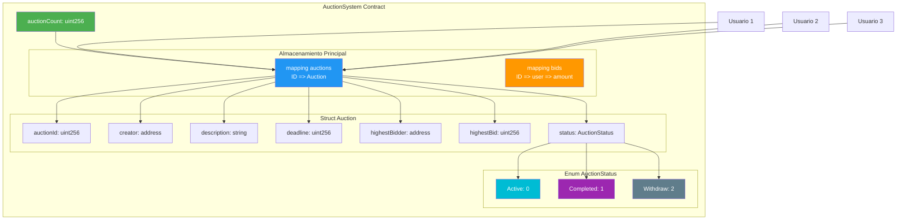

---

## Estructura de Datos

### 1. Enum AuctionStatus

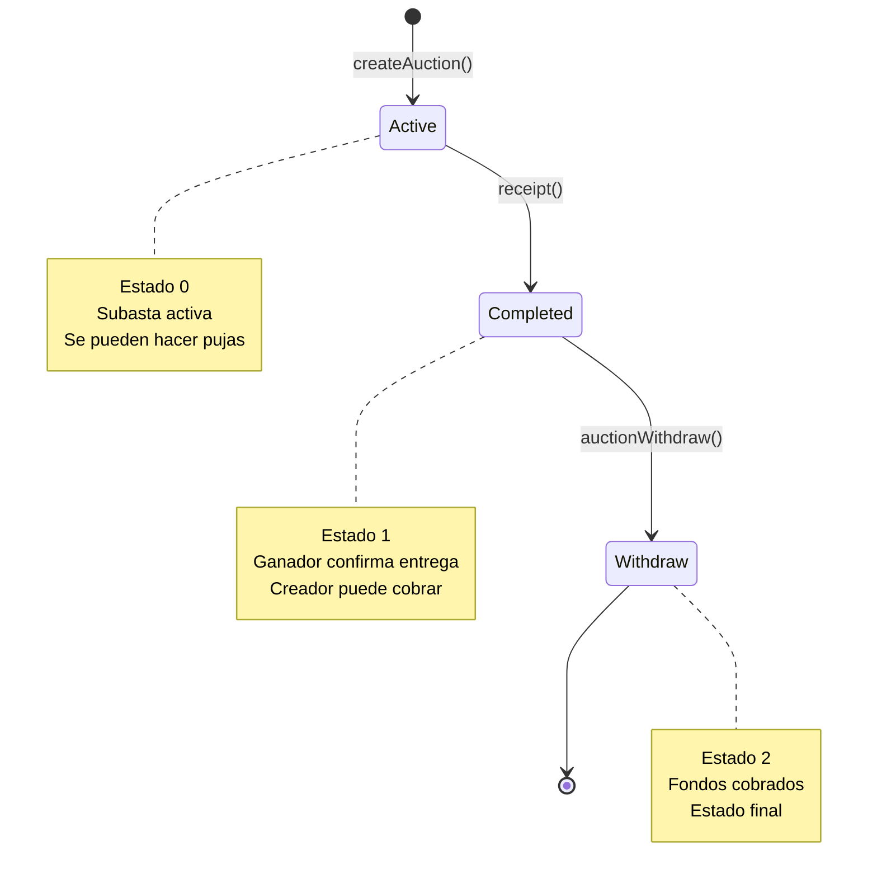

**Explicación:**
- `Active (0)`: Subasta recién creada, aceptando pujas
- `Completed (1)`: Ganador confirmó recepción del producto
- `Withdraw (2)`: Creador cobró los fondos (estado final)

### 2. Struct Auction

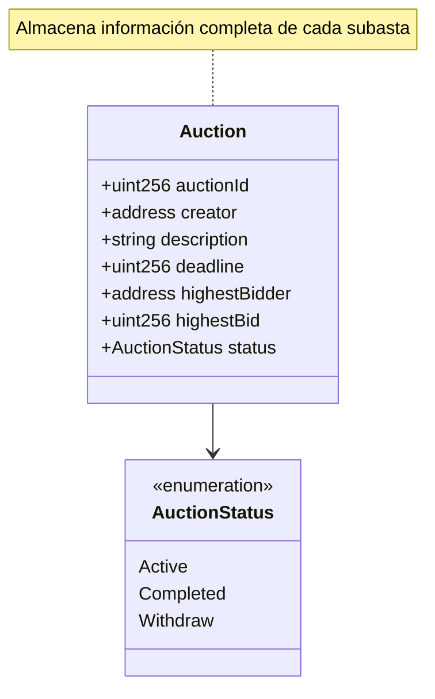

**Explicación:**
- `auctionId`: ID único e incremental (1, 2, 3...)
- `creator`: Dirección de la cartera que creó la subasta
- `description`: Descripción del producto subastado
- `deadline`: Timestamp de finalización
- `highestBidder`: Dirección de la cartera con la mejor puja
- `highestBid`: Cantidad de la puja más alta (en wei)
- `status`: Estado actual del ciclo de vida (Active/Completed/Withdraw)

### 3. Mappings Separados

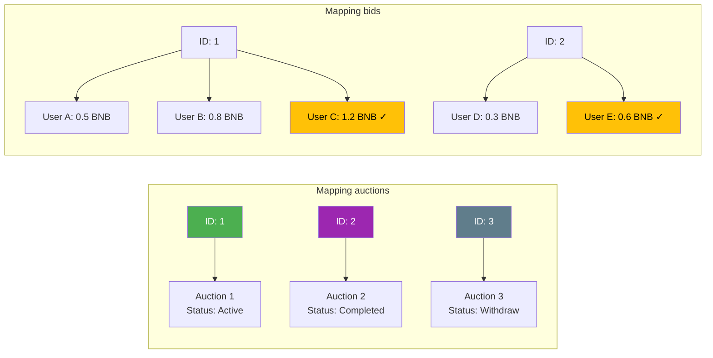

**¿Por qué mappings separados?**
- `auctions[auctionId]` = datos completos de la subasta
- `bids[auctionId][userAddress]` = cantidad pujada por usuario
  - Permite rastrear **todas** las pujas, no solo la ganadora
  - Necesario para sistema de reembolsos (`refund()`)

---

## Flujo de Funciones Principales

### Función 1: createAuction()

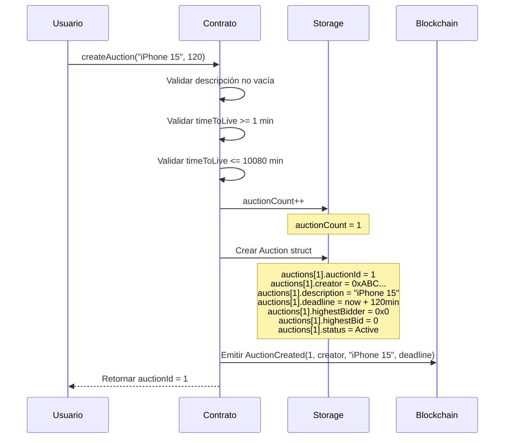

**Código clave:**
```solidity
function createAuction(string memory _description, uint256 timeToLive)
    external returns(uint256)
{
    // 1. Checks
    uint256 ttl = timeToLive * 1 minutes;
    require(ttl >= MIN_TIMETOLIVE && ttl <= MAX_TIMETOLIVE,
            "El tiempo de subasta no es validado");
    require(bytes(_description).length > 0,
            "La descripcion no puede estar vacia");

    // 2. Effects
    ++auctionCount;

    auctions[auctionCount] = Auction(
        auctionCount,
        msg.sender,
        _description,
        block.timestamp + ttl,
        address(0),
        0,
        AuctionStatus.Active  // ← Estado inicial
    );

    // 3. Interactions
    emit AuctionCreated(auctionCount, msg.sender, _description,
                        block.timestamp + ttl);

    return auctionCount;
}
```

**Constantes de tiempo:**
- `MIN_TIMETOLIVE = 1 minute`
- `MAX_TIMETOLIVE = 10080 minutes` (1 semana)

---

### Función 2: bid() - Realizar Puja

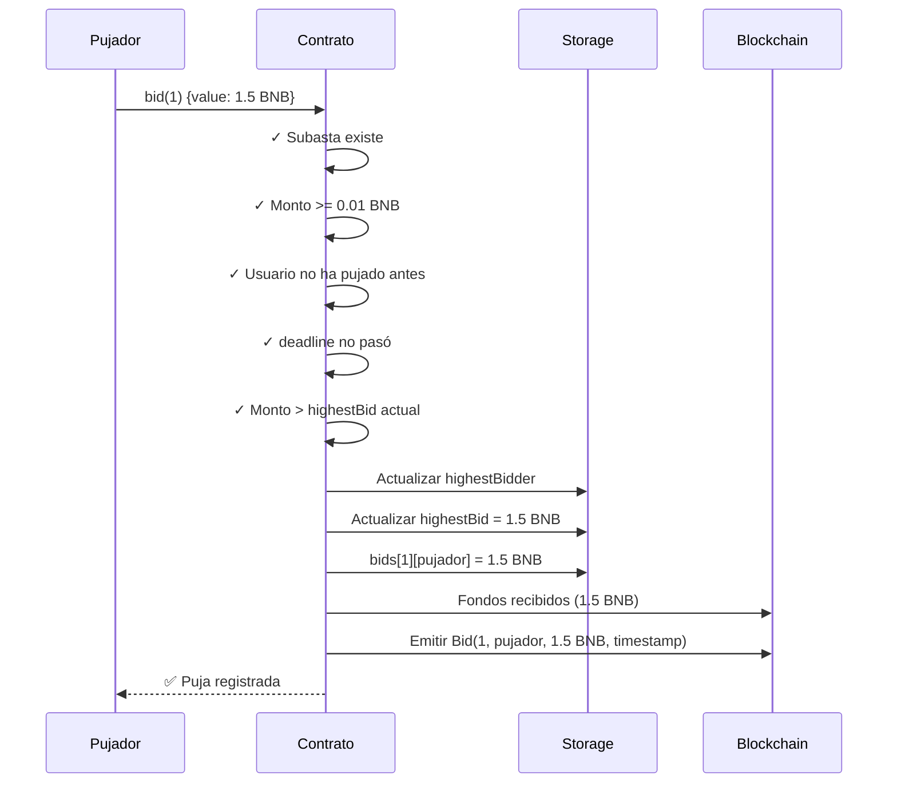

**Reglas importantes:**
- Puja mínima: `0.01 ether`
- Solo **una puja por usuario**
- Debe superar `highestBid` actual
- Solo antes de `deadline`

**Código clave:**
```solidity
function bid(uint256 _auctionId) external payable {
    Auction storage auction = auctions[_auctionId];

    // 1. Checks
    require(_auctionId > 0 && _auctionId <= auctionCount,
            "La subasta no existe.");
    require(msg.value >= MIN_BID,
            "La puja tiene que ser de al menos 0.01 ether.");
    require(bids[_auctionId][msg.sender] == 0,
            "No puedes volver a pujar.");
    require(block.timestamp < auction.deadline,
            "La subasta ya ha terminado.");
    require(msg.value > auction.highestBid,
            "La puja tiene que ser mayor que la puja actual.");

    // 2. Effects
    auction.highestBidder = msg.sender;
    auction.highestBid = msg.value;
    bids[_auctionId][msg.sender] = msg.value;

    // 3. Interactions
    emit Bid(_auctionId, msg.sender, msg.value, block.timestamp);
}
```

---

### Función 3: refund() - Reembolso de Perdedores

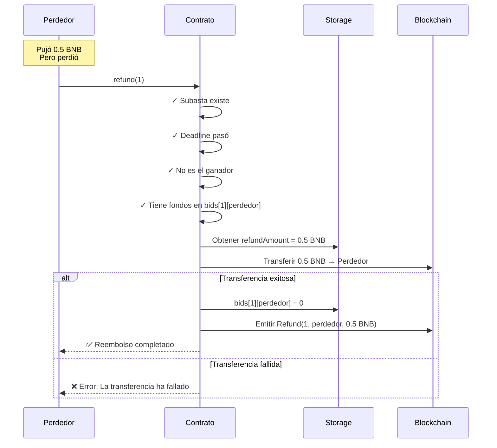

**Reglas:**
- Solo **después** de `deadline`
- **No** puede ser el `highestBidder`
- Debe tener fondos en `bids[auctionId][usuario]`
- Solo un reembolso por usuario (se pone a 0)

**Código clave:**
```solidity
function refund(uint256 _auctionId) external returns(uint256) {
    Auction storage auction = auctions[_auctionId];

    require(_auctionId > 0 && _auctionId <= auctionCount,
            "La subasta no existe.");
    require(block.timestamp > auction.deadline,
            "La subasta no ha terminado.");
    require(auction.highestBidder != msg.sender,
            "No puedes retirar tu puja, has ganado la subasta");
    require(bids[_auctionId][msg.sender] > 0,
            "No has pujado en esta subasta.");

    uint256 refundAmount = bids[_auctionId][msg.sender];

    // Transferencia segura
    (bool success, ) = payable(msg.sender).call{value: refundAmount}("");
    require(success, "La transferencia ha fallado");

    emit Refund(_auctionId, msg.sender, refundAmount);

    // Prevenir doble reembolso
    bids[_auctionId][msg.sender] = 0;

    return refundAmount;
}
```

---

### Función 4: receipt() - Confirmar Entrega

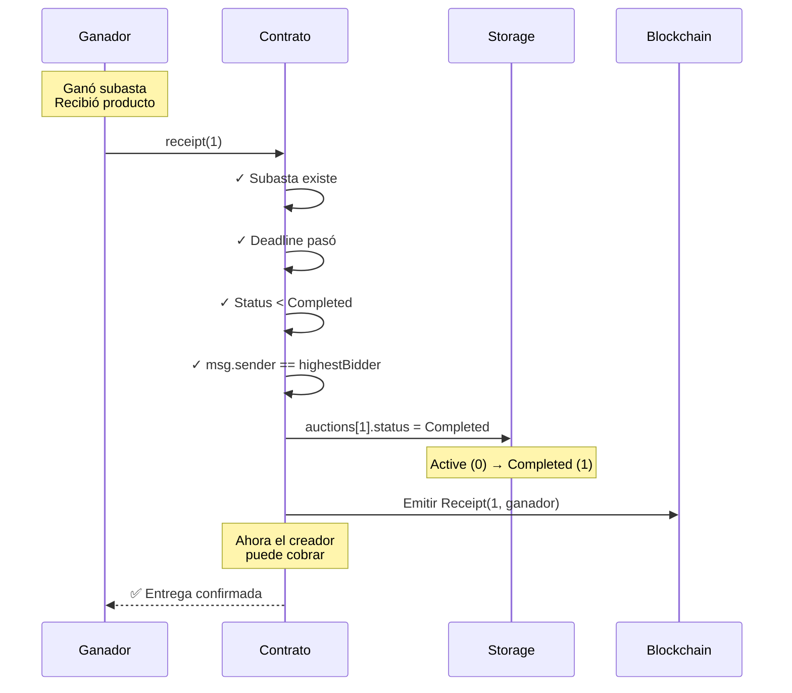

**Propósito:**
- Ganador confirma que **recibió el producto**
- Desbloquea fondos para que creador pueda cobrar
- Cambia estado: `Active → Completed`

**Código clave:**
```solidity
function receipt(uint256 _auctionId) external {
    Auction storage auction = auctions[_auctionId];

    require(_auctionId > 0 && _auctionId <= auctionCount,
            "La subasta no existe.");
    require(block.timestamp > auction.deadline,
            "La subasta no ha terminado.");
    require(auction.status < AuctionStatus.Completed,
            "La entrega ya ha sido confirmada");
    require(auction.highestBidder == msg.sender,
            "Solo la puja ganadora puede confirmar la entrega del articulo");

    // Cambio de estado crítico
    auction.status = AuctionStatus.Completed;

    emit Receipt(_auctionId, msg.sender);
}
```

---

### Función 5: auctionWithdraw() - Cobro del Creador

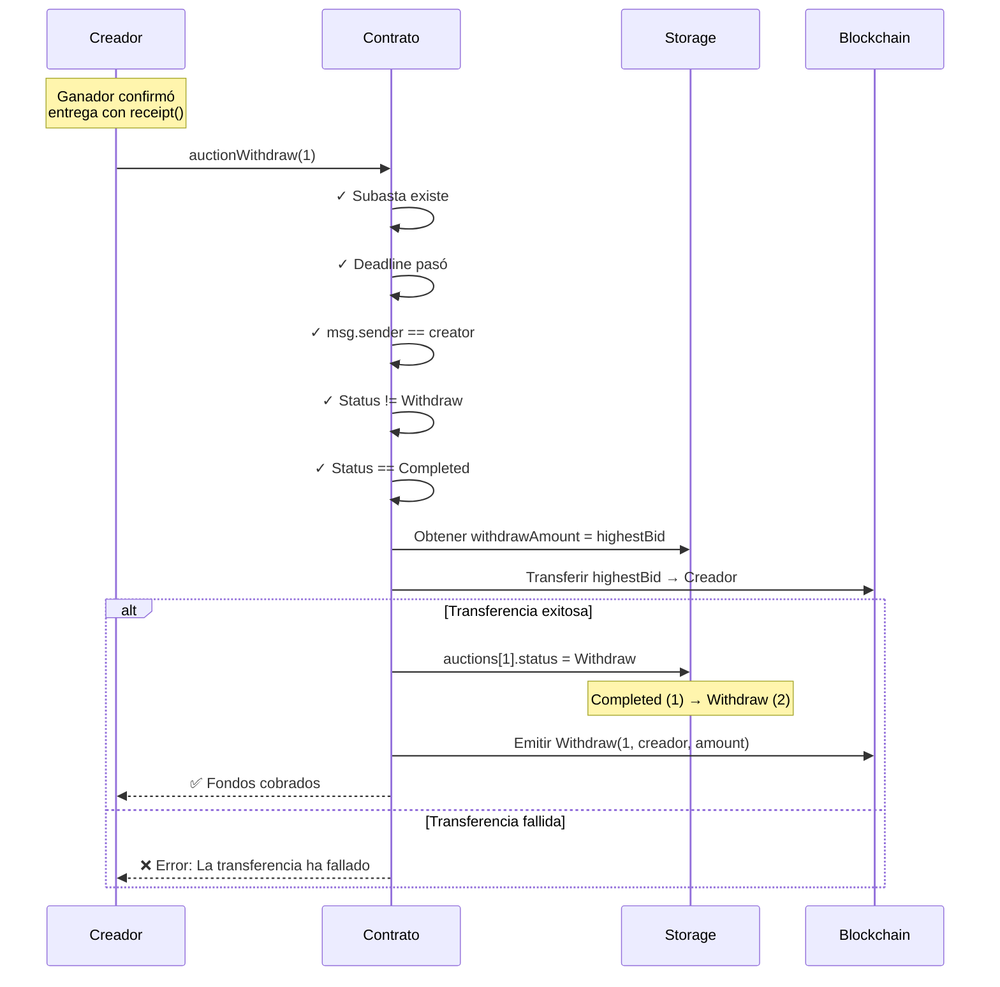

**Reglas estrictas:**
- Solo el **creator** puede cobrar
-  Status debe ser **Completed** (ganador confirmó entrega)
- Status **no** puede ser Withdraw (ya cobró)
- Solo después de `deadline`

**Código clave:**
```solidity
function auctionWithdraw(uint256 _auctionId) external returns (uint256) {
    Auction storage auction = auctions[_auctionId];

    require(_auctionId > 0 && _auctionId <= auctionCount,
            "La subasta no existe.");
    require(block.timestamp > auction.deadline,
            "La subasta no ha terminado.");
    require(auction.creator == msg.sender,
            "Solo el creador de la subasta puede cobrarla");
    // Separa la comprobación para tener dos mensajes de error independientes
    require(auction.status != AuctionStatus.Withdraw,
            "Ya se cobro la subasta.");
    require(auction.status == AuctionStatus.Completed,
            "El comprador no ha confirmado la entrega del articulo");

    uint256 withdrawAmount = auction.highestBid;
    require(withdrawAmount > 0, "No hay fondos para retirar.");

    // Transferencia segura
    (bool success, ) = payable(msg.sender).call{value: withdrawAmount}("");
    require(success, "La transferencia ha fallado");

    emit Withdraw(_auctionId, msg.sender, withdrawAmount);

    // Estado final
    auction.status = AuctionStatus.Withdraw;

    return withdrawAmount;
}
```

---

## Ciclo de Vida Completo de una Subasta

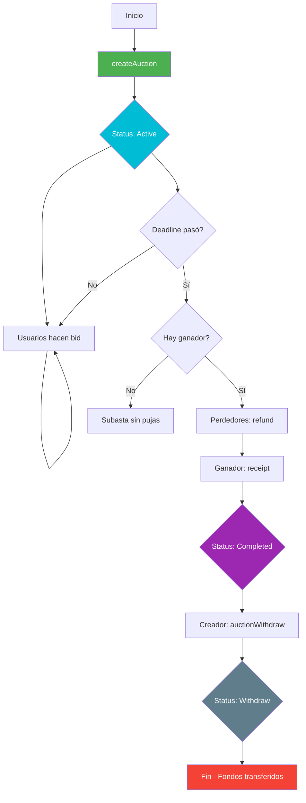

---

## Flujo de Fondos

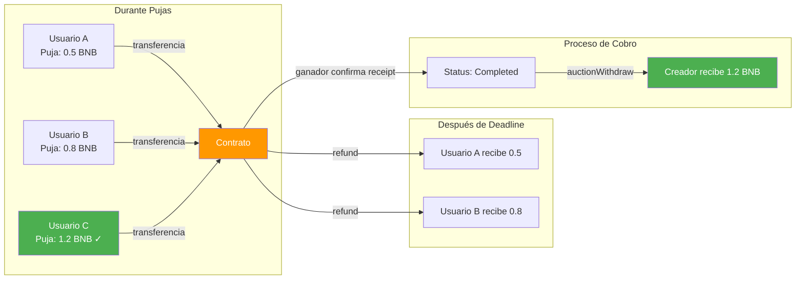

**Resumen:**
1. **Durante subasta**: Fondos quedan en el contrato
2. **Después deadline**: Perdedores pueden recuperar con `refund()`
3. **Ganador confirma**: Llama `receipt()` → Estado `Completed`
4. **Creador cobra**: Llama `auctionWithdraw()` → Recibe `highestBid`

---

## Medidas de Seguridad

### 1. Validación de Existencia
```solidity
require(_auctionId > 0 && _auctionId <= auctionCount,
        "La subasta no existe.");
```

### 2. Control de Tiempo
```solidity
require(block.timestamp < auction.deadline,  // Para pujar
        "La subasta ya ha terminado.");

require(block.timestamp > auction.deadline,  // Para refund/receipt
        "La subasta no ha terminado.");
```

### 3. Una Puja por Usuario
```solidity
require(bids[_auctionId][msg.sender] == 0,
        "No puedes volver a pujar.");
```

### 4. Transferencias Seguras
```solidity
(bool success, ) = payable(msg.sender).call{value: amount}("");
require(success, "La transferencia ha fallado");
```

### 5. Prevención de Doble Cobro
```solidity
// En refund()
bids[_auctionId][msg.sender] = 0;

// En auctionWithdraw()
require(auction.status != AuctionStatus.Withdraw,
        "Ya se cobro la subasta.");
auction.status = AuctionStatus.Withdraw;
```

### 6. Control de Roles
```solidity
// Solo ganador puede confirmar entrega
require(auction.highestBidder == msg.sender,
        "Solo la puja ganadora puede confirmar...");

// Solo creador puede cobrar
require(auction.creator == msg.sender,
        "Solo el creador de la subasta puede cobrarla");
```

---

## Ejemplo Completo: Subasta de iPhone

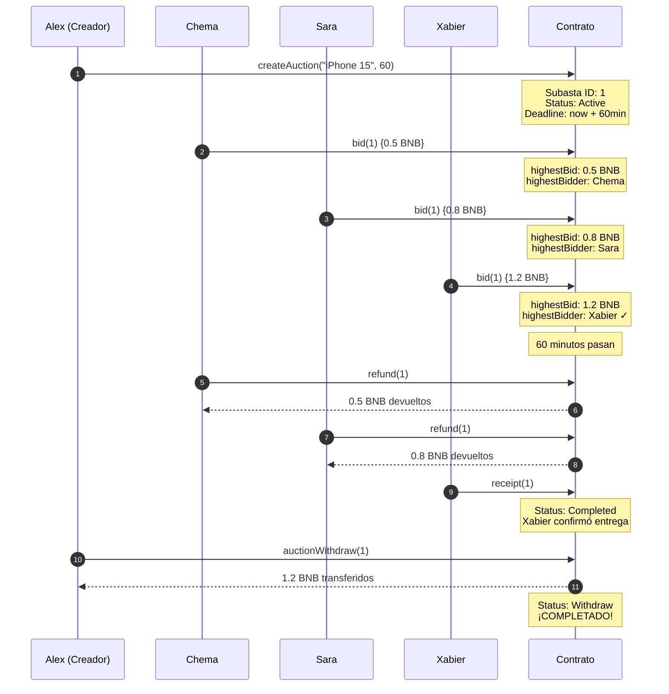

**Timeline:**
1. Alex crea subasta
2. Chema puja 0.5 BNB
3. Sara supera con 0.8 BNB
4. Xabier gana con 1.2 BNB
5. Deadline pasa
6. Chema y Sara recuperan fondos
7. Xabier confirma que recibió el iPhone
8. Alex cobra los 1.2 BNB

---

## Eventos Emitidos

| Evento | Parámetros | Cuándo se emite |
|--------|-----------|-----------------|
| `AuctionCreated` | auctionId, creator, description, deadline | Al crear subasta |
| `Bid` | auctionId, bidder, amount, timestamp | Al hacer puja |
| `Refund` | auctionId, bidder, refundAmount | Al devolver fondos a perdedor |
| `Receipt` | auctionId, winner | Al confirmar entrega |
| `Withdraw` | auctionId, creator, withdrawAmount | Al cobrar fondos |

---

## Resumen de Constantes

| Constante | Valor | Descripción |
|-----------|-------|-------------|
| `MAX_TIMETOLIVE` | 10080 minutes | 1 semana máxima |
| `MIN_TIMETOLIVE` | 1 minute | 1 minuto mínimo |
| `MIN_BID` | 0.01 ether | Puja mínima |

---

**Autor:** Alejandro de Cora
**Versión:** Solidity ^0.8.10
**Licencia:** MIT
