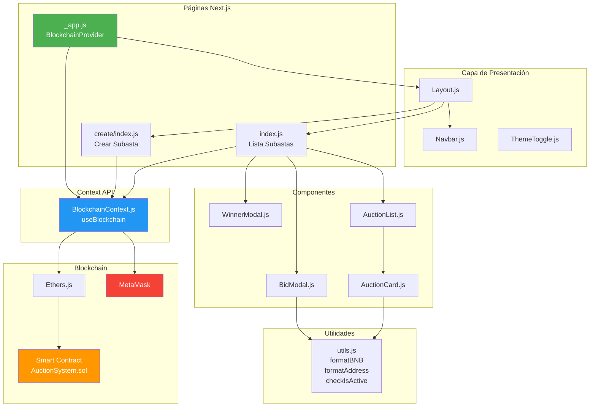

# Frontend - Subastas DApp

## Visión General

La [aplicación frontend es una **DApp (Aplicación Descentralizada)**](https://subastas-blockchain-dapp.web.app/) construida con **Next.js** y **React** que permite a los usuarios interactuar con el contrato inteligente `AuctionSystem.sol` desplegado en **BSC Testnet**. Utiliza **MetaMask** para la autenticación y firma de transacciones, y **Bootstrap** para la interfaz de usuario.

---

## Arquitectura Frontend



---

## Stack Tecnológico

| Tecnología | Versión | Propósito |
|------------|---------|-----------|
| **Next.js** | 16.1.6 | Framework React con SSR/SSG |
| **React** | 19.2.3 | Biblioteca de UI |
| **Ethers.js** | 5.8.0 | Interacción con blockchain |
| **Bootstrap** | 5.3.8 | Framework CSS |
| **React-Bootstrap** | 2.10.10 | Componentes React de Bootstrap |
| **MetaMask Detect** | 1.2.0 | Detección de wallet |
| **Ethers Decode Error** | 1.1.0 | Decodificación de errores |

---

## Estructura de Archivos

```
src/
├── components/
│   ├── AuctionCard.js       # Tarjeta individual de subasta
│   ├── AuctionList.js       # Grid de subastas
│   ├── BidModal.js          # Modal para realizar pujas
│   ├── WinnerModal.js       # Modal para ver ganador
│   ├── Layout.js            # Layout principal
│   ├── Navbar.js            # Barra de navegación
│   └── ThemeToggle.js       # Selector de tema
│
├── context/
│   └── BlockchainContext.js # Estado global blockchain
│
├── pages/
│   ├── _app.js              # Wrapper global
│   ├── _document.js         # HTML custom
│   ├── index.js             # Página principal (lista)
│   └── create/
│       └── index.js         # Página crear subasta
│
├── styles/
│   ├── app.css              # Estilos custom
│   └── globals.css          # Estilos globales
│
└── utils/
    └── utils.js             # Funciones auxiliares
```

---

**Autor:** Sistema de Subastas Descentralizado
**Stack:** Next.js 16.1.6 + React 19.2.3 + Ethers.js 5.8.0
**Network:** BSC Testnet
**Licencia:** MIT
